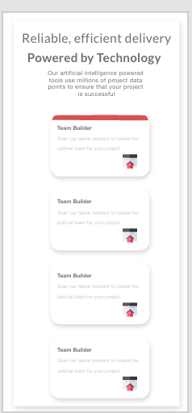

# Frontend Mentor - Four card feature section solution

This is a solution to the [Four card feature section challenge on Frontend Mentor](https://www.frontendmentor.io/challenges/four-card-feature-section-weK1eFYK). Frontend Mentor challenges help you improve your coding skills by building realistic projects.

## Table of contents

- [The challenge](#the-challenge)
- [Screenshot](#screenshot)
- [My process](#my-process)
  - [Built with](#built-with)
  - [What I learned](#what-i-learned)
  - [Useful resources](#useful-resources)
- [Author](#author)

### The challenge

Users should be able to:

- View the optimal layout for the component depending on their device's screen size
- See a hover state on desktop for the Sign Up call-to-action

### Screenshot




## My process

In the beginning of this process i used Adobe XD to create the design/layout and figure out what type of colors i wanted to use. Working in Figma would be slightly better, but i feel more comfortable in XD.

I created a color scheme with the exact colors that i would later use in my coding. Personally i think this is the right way to go - so you can make a mockup of your project and see it visually, not only thinking about it.

This also makes it easier to see if you are on the right track!

### Built with

To build this site i used the following:

- Semantic HTML5 markup
- CSS custom properties
- Grid
- SCSS/SASS
  -> https://sass-lang.com/

  ### What i learned

  The main thing i learned by doing this project was using display: Grid..

  Example:

  ```css
  .one {
    grid-column-start: 2;
    grid-row-end: 1;
  }
  ```
Basically the Grid works like a .. grid! If you imagine a square 3x3, the columns are at the top and the row are on the right side. Se exampel below: 
    C1 C2 C3
R1 |x |^ |x|
R2 |x |x |x|
R3 |x |x |x|


• Grid-column-start: Where the item column should start.
• grid-row-end: Where the item row should end.

... But I also learned how to work with scss/SASS, awesome guides/tutorials that i used are these:

-> Importing sass using npm:
https://www.geeksforgeeks.org/how-to-import-sass-through-npm/

-> Getting started with sass
https://www.w3schools.com/sass/default.php

### useful resources

Sites that I can strongly recommend and mainly used for this project:

• w3School - > https://www.w3schools.com/
Greate place to learn the basics of any coding language
• Frontend Mentor -> https://www.frontendmentor.io/home
Where i found this awesome project and many more!
• Pexels -> https://www.pexels.com
Amazing place to find high quality FREE photos and images
• Pattern monster -> https://pattern.monster/
Great place to create patterns form backgorunds!

### author

Yours truly - Emma Forsberg
